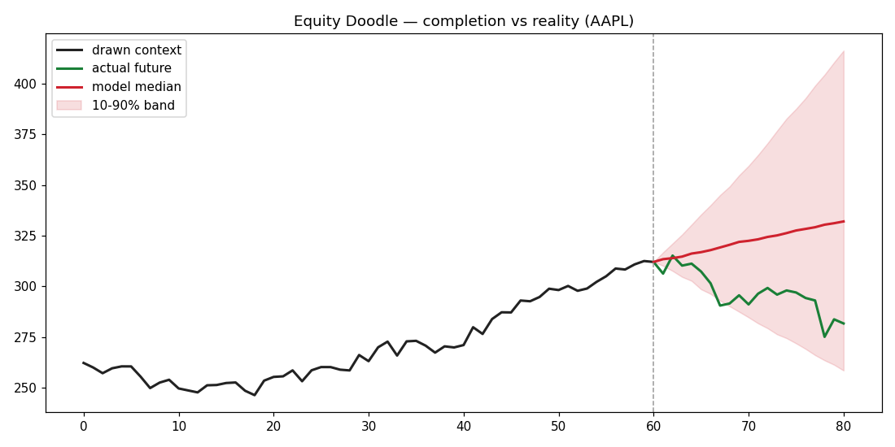

# Equity Doodle ✏️📈

**Draw the start of a chart — let the AI doodle the rest.**

Equity Doodle is a case-study project that frames stock-chart "completion" as a
time-series forecasting problem: the segment you draw is the model's **input
context window**, and the continuation it sketches is the **forecast horizon**.

A single *global* model is trained across many liquid equities (daily data), so
it learns the general "grammar" of price paths rather than memorizing one ticker.

> ⚠️ **This is an educational experiment, not a trading system.** See the
> [Disclaimer](#-disclaimer) below. It is not expected to be profitable, and
> that is fine — the goal is to study the modeling and product idea end-to-end.

---

## How it works

```
        you draw this                    the model completes this
   ┌───────────────────────┐        ┌─────────────────────────────┐
   price path (context)            quantile "fan" of continuations
   └───────────────────────┘        └─────────────────────────────┘
            │                                      ▲
            ▼                                      │
   convert to log-returns ──► global ML model ──► future returns ──► rebuild price
```

1. **Data** — daily OHLCV for a basket of liquid equities via `yfinance`.
2. **Features** — prices are converted to **log-returns** (stationary and
   comparable across tickers), so an arbitrary hand-drawn chart at any price
   scale can be fed in directly.
3. **Model** — a **global gradient-boosted model** (Darts `LightGBMModel`) with
   lagged features and **quantile regression**, so we get a probabilistic "fan"
   of possible completions rather than a single line.
4. **Reconstruct** — predicted returns are integrated back into a price path,
   starting from the last point you drew.

## Time-scale invariance

Equity Doodle is built to be **time-scale invariant** — you can train on any
resolution and draw at any resolution (intraday, daily, weekly) at any price
scale. Three mechanisms make that work:

1. **Integer index, return space** — the model forecasts log-returns on a plain
   integer index, so the calendar never enters.
2. **Per-window z-scoring** — the drawn window is normalized to zero-mean /
   unit-variance before the model sees it, then predictions are rescaled by the
   window's own volatility. This removes the volatility-scale dependence (daily
   vs weekly magnitudes) and means a jagged doodle yields a jagged completion.
3. **Multi-scale training** — each daily series is aggregated into block-sum
   returns at scales k = 1, 2, 3, 5, 10, 21 bars, so one global model learns the
   shape of price paths across resolutions.

This makes it *scale-robust*; perfect invariance is impossible because the
statistical structure of returns genuinely differs by scale — a real finance
fact, not a bug.

## Roadmap

- [x] Project scaffold, license, disclaimer
- [x] Data pipeline (`equity_doodle/data.py`) — download + cache daily OHLCV
- [x] Feature transforms (`equity_doodle/features.py`) — price ⇄ log-returns
- [x] Global quantile model (`equity_doodle/model.py`) — multi-scale, scale-invariant
- [x] Honest out-of-sample backtest (`scripts/backtest.py`)
- [x] Forecast API (`equity_doodle/forecast.py`) — drawn path → completion
- [x] Web app — a canvas where you draw a chart and the AI finishes it

## Setup

```bash
python -m venv .venv && source .venv/bin/activate
pip install -r requirements.txt
```

## Usage

```bash
# 1. Download daily data for the default ticker universe (free, no API key)
python scripts/download_data.py

# 2. Train the global, scale-invariant model
python scripts/train.py

# 3. Backtest honestly (out-of-sample, daily + weekly)
python scripts/backtest.py

# 4. Launch the drawing web app, then open http://localhost:8000
uvicorn equity_doodle.app:app --reload
```

### Sample completion

The backtest saves a fan-chart comparing the model's completion to what actually
happened on a held-out window:



## ⚖️ Disclaimer

Equity Doodle is provided for **educational and research purposes only**. It is
**not financial, investment, trading, or any other kind of advice**. Nothing it
produces is a recommendation to buy or sell any security. Forecasts are the
output of a statistical model fit on historical data and are very likely to be
**wrong**; past patterns do not predict future prices. **Do not make financial
decisions based on this software.** You use it entirely at your own risk. See
[`LICENSE`](LICENSE) — the software is provided **as is, without warranty of any
kind, and the author accepts no liability** for any damages or losses.

## License

Licensed under the **PolyForm Noncommercial License 1.0.0** — free for
noncommercial use only. See [`LICENSE`](LICENSE). For any commercial use, please
contact the author.

Required Notice: Copyright © 2026 Keaton Zang
